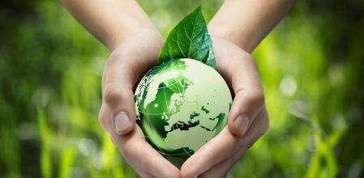

# Proteccion del Medio Ambiente

## Introducción 
La raza humana solo tiene un hogar, el planeta tierra, y poco a poco lo estamos degradando, contaminando, destruyendo.

Si queremos un futuro, necesitamos cuidarlo y cambiar muchas cosas.

## Contenidos
- [¿Qué es la protección en el medio ambiente?](proteccion.md)

- [¿Cuáles son los riesgos ambientales?](riesgos.md)

- [¿Cuáles son los objetivos de la protección del medio ambiente?](objetivos.md)

- [¿Cómo podemos garantizar la protección del medio ambiente?](garantizar.md)

## Licencia

