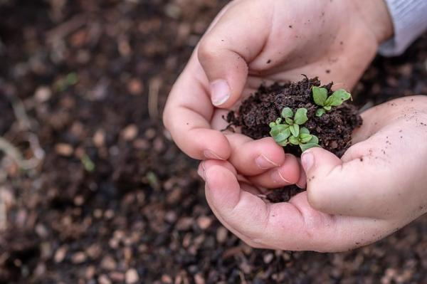

## ¿Cómo podemos garantizar la protección del medio ambiente?

Todos podemos adoptar pequeñas medidas para cuidar el medio ambiente en nuestro día a día.

Siempre que sea posible, debemos cambiar los patrones de consumo e integrar en nuestra rutina hábitos sostenibles y respetuosos con el medio ambiente, con el objetivo de reducir la contaminación.
Para cuidar el medio ambiente, podemos realizar 7 sencillas prácticas para protegen el medio amiente y combatir el efecto invernadero:
- Reciclar
- Ahorrar agua
- Apoyar energias renovables 
- Evitar consumismo
- Reducir el consumo innecesario
- Usar papeleras y contenedores
- Usar envases biodegradables 

[Referencia](https://www.solideo.es/7-medidas-para-cuidar-el-medio-ambiente/)
