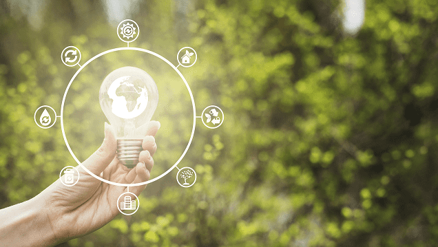

## ¿Cuáles son los objetivos de la protección del medio ambiente?

 Los objetivos principales y primordiales de la protección ambiental y los cuales se tiene que basar son:
 
- Reducir la producción de residuos.

- Incrementar su reutilización y reciclaje.

- Minimizar los rechazos destinados a vertederos.

- Maximizar su valorización.

- Asegurar el adecuado tratamiento de los diferentes tipos de residuos que se
producen.

- Establecer distintas instalaciones para la gestión de residuos y posterior reciclaje. 

[Referencia](https://www.tenerife.es/planes/PTEOResiduos/adjuntos/Info_SostenibilidadCap05.pdf)
