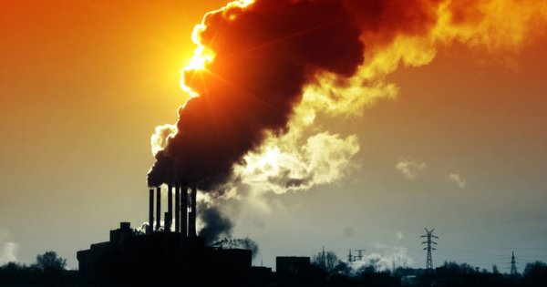

## ¿Cuáles son los riesgos ambientales?

Los riesgos ambientales son factores que favorecen la posibilidad de que el medio experimente daños, dando iguals si dicho daño es provocado por el hombre o por la misma naturaleza.

Dentro de estos riesgos ambientales hay dos aspectos que facilita esta definición: 

- `La frecuencia con la que pueden ocurrir. `
- `La gravedad de que esto suceda.`

Un ejemplo de frecuencia puede ser que, un valle, es más probable que se inunde que una colina, y, respecto a la gravedad, las consecuencias derivadas de la inundación de ese valle, como la destrucción de cultivos y viviendas.

Dichos riesgos pueden prevenirse

[Referencia](https://www.universitatcarlemany.com/actualidad/que-son-los-riesgos-ambientales-principales-ejemplos)
